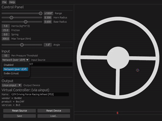

pen-steer
=========
Use a drawing tablet, or something similar, as a steering wheel.

Available for Linux and Windows (WIP).

**Notice: somewhat useable but unpolished. Read on for more info.**


---------

## Why?
Mouse steering is alright ([Euro Truck Simulator 2](https://eurotrucksimulator2.com/), etc.), but I wanted to see if it would be
practical to use a drawing tablet. Surprisingly, it's not that bad; it does take a bit of practice to draw a circle at the centre.
I would still use an actual wheel if I could afford one, though.

As far as I know, there isn't anything else like this (or I didn't search enough), so I made this.
Though, I am probably not the first person to try something like this.

This Rust application is not my first attempt, I wrote the initial prototype in C and a cursed bunch of `ioctl()`s.

## Features
  - Draw circles to turn the wheel.
  - Press the centre to activate the horn.
  - Configurable range.
  - Configurable physics settings. (inertia, friction, etc.)
  - Adjustable area mapping. (needs more work)
  - Run without the GUI via `--headless`. (quite limited at the moment)
  - Save/load configuration. (needs more work)
  - Force-feedback! Allows the wheel to i.e. centre itself in a realistic-ish way:



_Not all output devices support force-feedback._

---

Pen input can be collected from a few sources:
  - Dummy - does nothing
  - Net - reads input via UDP socket
  - Wintab - [WIP] uses Wacom Wintab API (Windows only)
  - Evdev - reads input from `/dev/input/eventX`. (Linux only)

There are a few methods to fake a virtual controller:
  - Dummy - no output at all
  - uinput - uses Linux's [uinput module](https://kernel.org/doc/html/v4.12/input/uinput.html). (Linux only)
  - ViGEm - uses [ViGEm](https://docs.nefarius.at/projects/ViGEm/) (Windows only)

## TODO
This thing works okay, but needs more work.
  - Wintab support for Windows.
  - Less clunky control panel.

## Building
Clone the repository and compile with the command:

```
cargo build --release
```

or run it with:

```
cargo run --release
```

To use this application without a GUI, simply use the `--headless` option:

```
./pen-steer --headless
```

## Net Source
Listens for pen input via UDP.

By default, it will listen on `127.0.0.1:16027`.

As an example, an [OpenTabletDriver](https://opentabletdriver.net/) plugin can be used to send pen positions over UDP.

See [OtdReport.cs](https://gist.github.com/a455jldvmsrwll1a/6caadae316594e1daa0cb0e9ec72eea6) for a (messy) code example.

### Packet Format
```
+-------------------------------------------------------+
|                 Pen Packet (13 bytes)                 |
+------------+------------+---------------+-------------+
| pos_X: f32 | pos_Y: f32 | pressure: u32 | buttons: u8 |
+------------+------------+---------------+-------------+
```
Fields are expected to be in little-endian.

`pos_X` and `pos_Y` are expected to be normalised [-1.0, 1.0].

`buttons` is a bitfield.

## Evdev Source
Reads from a `/dev/input/event*` file. You may need to either run as the `root` user (not ideal), or add your user to the `input` group (less worse).


## uinput Device
Currently the only device available for Linux. It uses Linux's uinput API.

**You may need to either run as the `root` user (not ideal), or add your user to the `input` group (less worse).**

## ViGEmBus Device
Currently the only device available for Windows. It uses the [ViGEmBus driver](https://github.com/nefarius/ViGEmBus), which is
no longer being updated, to emulate a virtual joystick.

Force-feedback is *not supported*.

**You will need to install the driver for this output method to work.**
