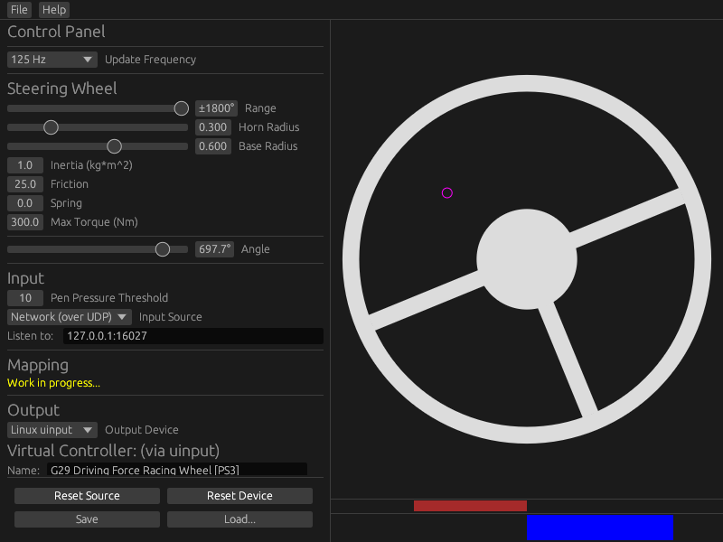

pen-steer
=========
Use a drawing tablet, or something similar, as a steering wheel.

Available for Linux and ~~Windows~~ (WIP).

**Notice: not very usable right now. Read on for more info.**


---------

## Why?
Mouse steering is alright ([Euro Truck Simulator 2](https://eurotrucksimulator2.com/), etc.), but I wanted to see if it would be
practical to use a drawing tablet. Surprisingly, it's not that bad. I would still use an actual
wheel if I could afford one, though.

As far as I know, there isn't anything else like this (or I didn't search enough), so I made this.
Though, I am definitely not the first person to try something like this.

This Rust application is not my first attempt, I wrote the initial prototype in C and a cursed bunch of `ioctl()`s.

## Features
  - Draw circles to turn the wheel.
  - Press the centre to activate the horn.
  - Configurable range.
  - Configurable physics settings. (inertia, friction, etc.)
  - Force-feedback! Allows the wheel to i.e. centre itself in a realistic-ish way.
  - Run without the GUI via `--headless`. (quite limited at the moment)

Pen input can be collected from a few sources:
  - Dummy - does nothing
  - Net - reads input via UDP socket
  - Wintab - [WIP] uses Wacom Wintab API (Windows only)

There are a few methods to fake a virtual controller:
  - Dummy - no output at all
  - uinput - uses Linux's [uinput module](https://kernel.org/doc/html/v4.12/input/uinput.html). (Linux only)
  - ViGEm - [WIP] uses [ViGEm](https://docs.nefarius.at/projects/ViGEm/) (Windows only)

## TODO
This thing barely works, but is missing many features.
  - Save/load configuration.
  - Adjustable area mapping.
  - etc.

## Building
Clone the repository and compile with the command:

```
cargo build --release
```

or run it with:

```
cargo run --release
```

To use this application without a GUI, simply use the `--headless` option:

```
./pen-steer --headless
```

_Currently, the only way to adjust settings is by manually editing `src/config.rs` and recompiling._
_Proper load/save is in the works._

## Net Source
Currently the only source available. It listens for pen input via UDP.

By default, it will listen on `127.0.0.1:16027`.

### Packet Format
```
+-------------------------------------------------------+
|                 Pen Packet (13 bytes)                 |
+------------+------------+---------------+-------------+
| pos_X: f32 | pos_Y: f32 | pressure: u32 | buttons: u8 |
+------------+------------+---------------+-------------+
```
Fields are expected to be in little-endian.

`pos_X` and `pos_Y` are expected to be normalised [-1.0, 1.0].

`buttons` is a bitfield.

## uinput Device
Currently the only device available. It uses Linux's uinput API.

**You may need to run as `root`, or better yet, just add your user to the `input` group.**
